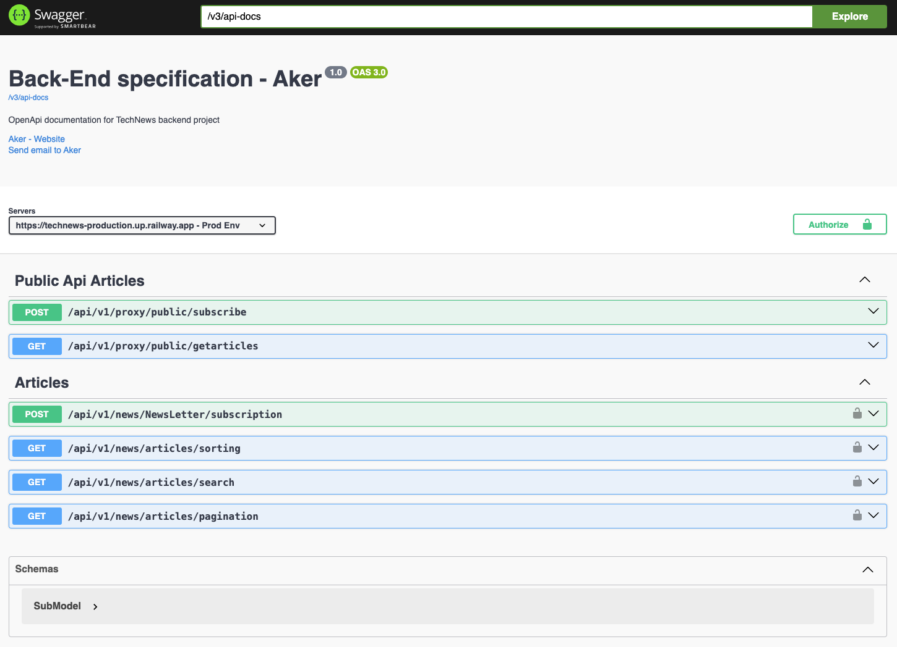

# TechNews
TechNews is a web application that aggregates and delivers the latest tech news to users. 
Users can subscribe to newsletters, search for articles based on keywords, 
and stay updated with the most recent technology trends. 
This project includes a backend API to manage news articles and a front-end interface for users to interact with the application.
You can check documentaion via this link:
[Documentation](https://technews-production.up.railway.app/swagger-ui/index.html#/)

You can find front-End implementation here: [Front-end](https://github.com/aker2302/NewsTech_FrontEnd)
## Features
 - News Aggregation: Fetches and displays tech news articles based on user-specified keywords.
 - Newsletter Subscription: Users can subscribe to a newsletter to receive regular updates.
 - Pagination: Supports pagination for efficient browsing of news articles.
 - Rate Limiting: Ensures fair usage of the API endpoints.
 - Error Handling: Handles various errors and provides meaningful responses.
## Technologies Used
### Backend
 - Spring Boot: Main framework for developing the REST API.
 - Spring Data Mongo: For database interactions.
 - Spring Security: To handle authentication and authorization.
 - MonoDB: Database to store user and news article data.
 - Rate Limiter: For controlling the rate of API requests.
 - Spring Cache: Caching api responses to reduce database calls 

   | Technology      | version |  
      |-----------------|---------|
   | Java            | 17      |
   | Spring boot     | 3.2.3   |
   | Resilience4j    | 2.2.0   |
    | OpenApi         | 2.5.0   |
   | Spring security | 3.2.3   |

### Directory tree
```bash
TechNews
├── .idea
├── target
├── TechNews_Backend [TechNews]
│   ├── .mvn
│   ├── src
│   │   ├── main
│   │   │   ├── java
│   │   │   │   └── com
│   │   │   │       └── aker.TechNews
│   │   │   │           ├── Config
│   │   │   │           │   ├── CacheCustomizer
│   │   │   │           │   ├── MailSenderConfig
│   │   │   │           │   ├── OpenApiDocConfig
│   │   │   │           │   ├── RateLimiterCustomConfig
│   │   │   │           │   └── SecurityConfiguration
│   │   │   │           ├── Controller
│   │   │   │           │   ├── ApiProxyController
│   │   │   │           │   └── TechNewsController
│   │   │   │           ├── entity
│   │   │   │           │   ├── Article
│   │   │   │           │   └── NewsLetterSub
│   │   │   │           ├── exception
│   │   │   │           ├── filter
│   │   │   │           │   ├── ApiKeyAuth
│   │   │   │           │   └── ApiKeyAuthFilter
│   │   │   │           ├── model
│   │   │   │           ├── Repository
│   │   │   │           ├── response
│   │   │   │           ├── Service
│   │   │   │           │   ├── apinews
│   │   │   │           │   │   ├── DataLoader
│   │   │   │           │   │   └── NewsApi
│   │   │   │           │   ├── implementation
│   │   │   │           │   │   ├── ArticleServiceImp
│   │   │   │           │   │   ├── ClientAuthenticationService
│   │   │   │           │   │   ├── EmailSenderService
│   │   │   │           │   │   ├── NewsLetterService
│   │   │   │           │   │   └── ArticleService
│   │   │   │           │   └── Application
│   │   │   │           └── mysql
│   │   │   ├── resources
│   │   │   │   ├── static
│   │   │   │   └── templates

```
